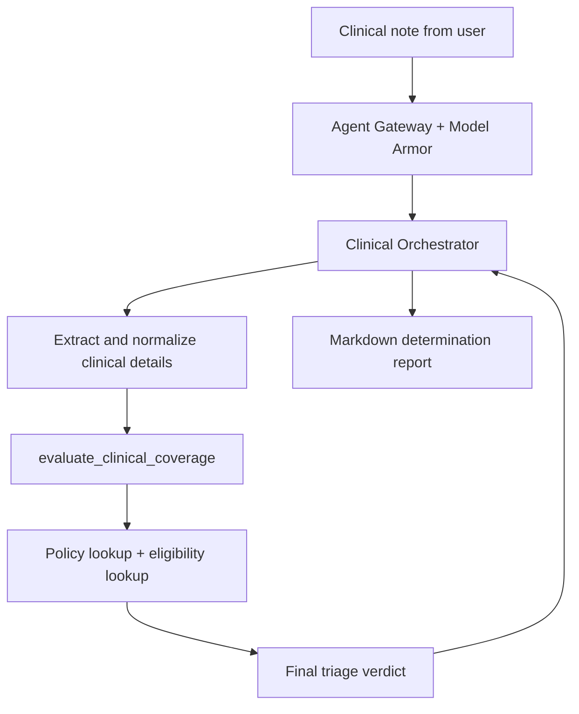

# Clinical Intake & Prior-Auth Triage — ADK Multi-Agent Demo

Synthetic demo only. No real PHI anywhere in this repo.

## Workflow



The current workflow uses `root_agent` directly. It extracts and normalizes
the note, then makes exactly one model tool call to
`evaluate_clinical_coverage`. The standalone `clinical_extractor_agent` and
`coverage_evaluator_agent` modules remain in the repository as specialist
implementations, but neither is registered as a sub-agent of `root_agent`.

### Single-tool calling contract

The orchestrator exposes one callable tool through `FunctionTool`:
`evaluate_clinical_coverage(cpt_code, payer_id, member_id)`. The model must
call it exactly once per note, using the primary CPT code, the normalized
payer ID, and the member ID when available. Missing values are passed as
`null`; the orchestrator does not ask follow-up questions.

The tool is the application-layer encapsulation boundary. It deterministically
calls `check_coverage_policy` and, only when both `member_id` and `payer_id`
are present, `check_member_eligibility`, then returns both results in one
structured response. The model synthesizes its report from that response; it
does not call the inner lookup functions directly or invent policy criteria.
This keeps the model-facing tool surface stable while allowing the backing
store to switch between local JSON and BigQuery via `POLICY_DATA_BACKEND`.

## A2A conversion (for Agent Registry / Gateway integration)

The native ADK deployment path registers a `provisioned_reasoning_engine`,
which does not receive a SPIFFE identity. That prevents Agent Registry and
Agent Gateway integration from applying the intended Model Armor and gateway
policies. This conversion exposes the orchestrator through A2A so the Agent
Runtime deployment can be discovered in Agent Registry and imported into
Gemini Enterprise through the Agent Gateway-backed flow.

The conversion adds:

- `clinical_orchestrator/agent_card.py`, with the
  `clinical-intake-prior-auth-triage` Agent Card and a
  `clinical_intake_triage` skill.
- `clinical_orchestrator/a2a_server.py`, which exposes the unchanged
  `root_agent` with ADK's `to_a2a(root_agent, host="localhost", port=8000,
  agent_card=agent_card)` wrapper for local A2A serving.
- `clinical_orchestrator/a2a_executor.py`, the Agent Runtime executor bridge
  used by the codelab-compatible `A2aAgent` deployment adapter.

Run `python deployment/deploy.py` with the existing `.env` ADC settings. The
script loads `GOOGLE_APPLICATION_CREDENTIALS` from `.env`, and the Google
Cloud SDK resolves it through the standard ADC environment path; no
credentials object is passed explicitly to a client. The existing native ADK
deployment remains available as `deploy_native_agent()` in
`deployment/deploy.py` for rollback or comparison testing.

The codelab uses `A2aAgent` for Agent Runtime deployment and `to_a2a()` for a
local Starlette server, so this repository keeps both compatible entry points:
the shared Agent Card is used by both, while the existing root agent and its
clinical sub-agent delegation remain unchanged.

### Test locally

Install the pinned dependencies from the repository root:

```powershell
python -m pip install -r requirements.txt
```

For the existing native ADK smoke test, run one synthetic note from the
`healthcare_triage_agent` directory:

```powershell
python run_local_demo.py synthetic_notes/note_01_tka_golden_path.txt
```

To test the A2A surface itself, start the local Starlette server from the
workspace parent directory so the package imports resolve:

```powershell
cd ..
python -m uvicorn healthcare_triage_agent.clinical_orchestrator.a2a_server:a2a_app --host 127.0.0.1 --port 8000
```

In a second PowerShell window, confirm the Agent Card is discoverable:

```powershell
Invoke-RestMethod http://127.0.0.1:8000/.well-known/agent-card.json
```

Then send a simple A2A request:

```powershell
$note = Get-Content -Raw synthetic_notes/note_01_tka_golden_path.txt
$body = @{
  jsonrpc = "2.0"
  id = "local-test-1"
  method = "message/send"
  params = @{
    message = @{
      messageId = "local-message-1"
      role = "user"
      parts = @(@{ kind = "text"; text = "Evaluate this clinical note for prior authorization:`n`n$note" })
    }
  }
} | ConvertTo-Json -Depth 8
Invoke-RestMethod http://127.0.0.1:8000/ -Method Post -ContentType "application/json" -Body $body
```

The response should contain an A2A task and the orchestrator's clinical
determination. The local path does not apply Agent Gateway or Model Armor;
those policies apply after the A2A agent is deployed and routed through the
managed gateway.

## Structure
```
healthcare_triage_agent/
  clinical_orchestrator/     # Primary/root agent (parent-orchestrator pattern)
  sub_agents/
    clinical_extractor/      # Unstructured note -> structured JSON
    coverage_evaluator/      # Deterministic policy lookup + verdict
  security/
    blocked_tools.py         # Intentionally-nonfunctional modify_patient_records
    model_armor_agent_gateway_config.yaml
  mock_data/
    policy_rules.json        # Mock payer policy + eligibility data (local backend)
    bigquery/                # NDJSON + schemas for the BigQuery backend
      cpt_rules.jsonl / cpt_rules_schema.json
      member_eligibility.jsonl / member_eligibility_schema.json
  synthetic_notes/           # 5 unstructured clinical notes + adversarial prompts
  deployment/
    deploy.py                # Deploy to Agent Runtime (file-based ADC auth)
    setup_bigquery.sh         # Provision dataset/tables/IAM for the BQ backend
  run_local_demo.py          # Local sanity check (adk web/run also works)
```

## Model
All agents use `gemini-2.5-flash` as requested. One thing worth flagging:
current ADK guidance (mid-2026) treats newer Gemini 3.x flash variants as the
default recommendation for agentic workloads. 2.5-flash is still fully
supported and fine for this demo, but if you're optimizing for latency/cost
on the live call, worth a quick side-by-side before the webinar rather than
assuming 2.5 is still the best choice by then.

## Authentication
**ADC for deployment and BigQuery setup:** `deployment/deploy.py` and
`deployment/setup_bigquery.sh` load credentials from the path in
`GOOGLE_APPLICATION_CREDENTIALS`. The `.env.example` file contains the
default path for this demo; set that variable to a different credential file
when running on another machine. Keep the JSON key file private and out of
source control.

## GCS vs BigQuery — which one do you need?

**Both, for different things — not either/or:**

- **GCS bucket (required, not optional):** Agent Runtime/Agent Engine
  deployment itself needs a staging bucket to package your code and
  dependencies (`AGENT_ENGINE_STAGING_BUCKET` in `.env.example`). This is
  infrastructure plumbing, not a place to "store your demo assets" — treat
  it as ephemeral deployment packaging.

- **BigQuery (recommended for the policy/eligibility data):** Your
  `check_coverage_policy` / `check_member_eligibility` tools are doing
  structured, relational, filterable lookups (CPT code → rule, payer+member
  → eligibility). That's a BigQuery-shaped problem, not a blob-storage
  problem. `sub_agents/coverage_evaluator/tools.py` supports both backends
  behind a `POLICY_DATA_BACKEND` env var (`local` reads the bundled JSON,
  `bigquery` queries a real dataset) — see **BigQuery setup** below for how
  to provision and switch to it.

- **GCS also makes sense for the *unstructured* synthetic notes** (the
  `.txt` referral letters) if you want the demo to simulate an intake
  pipeline that pulls a fax/PDF/portal message from a bucket before handing
  it to the extractor agent — that's unstructured document storage, which
  is exactly what GCS is for. Don't put the structured policy rules there.

Rule of thumb: **structured/queryable → BigQuery, unstructured documents /
deployment artifacts → GCS.** Using GCS for the policy table would work but
you'd end up re-implementing filtering/joins in Python for no benefit.

## BigQuery setup

Two tables, both under `mock_data/bigquery/` as newline-delimited JSON
(chosen over flat CSV because `cpt_rules.criteria` is a repeated/array
field, which BigQuery loads natively from NDJSON but not cleanly from CSV):

| File | Table | Clustered on | Source data |
|---|---|---|---|
| `cpt_rules.jsonl` + `cpt_rules_schema.json` | `cpt_rules` | `cpt_code, payer_id` | Policy/criteria per CPT code, with payer-specific override rows |
| `member_eligibility.jsonl` + `member_eligibility_schema.json` | `member_eligibility` | `payer_id, member_id` | Mock member eligibility roster |

To provision:
```bash
export GOOGLE_CLOUD_PROJECT=your-project
export POLICY_BQ_DATASET=payer_policy_demo   # optional, this is the default
export BQ_LOCATION=US                        # match your Agent Runtime region
bash deployment/setup_bigquery.sh
```
On Windows without WSL, run the PowerShell version instead. It loads the
existing `.env` file automatically, including the configured ADC path:
```powershell
.\deployment\setup_bigquery.ps1
```
This creates the dataset, creates both tables with explicit schemas (no
autodetect — don't let BigQuery guess types for a compliance demo), loads
the NDJSON data, and grants the **Agent Runtime service agent**
(`service-<PROJECT_NUMBER>@gcp-sa-aiplatform-re.iam.gserviceaccount.com`) —
not a key file — `roles/bigquery.dataViewer` on the dataset and
`roles/bigquery.jobUser` on the project, which is what it needs to run the
parameterized queries in `tools.py`.

**Code/`.env` changes needed — summary:**
- `sub_agents/coverage_evaluator/tools.py` already supports both backends;
  nothing further to edit there unless you change the schema.
- `.env` (local): add `POLICY_DATA_BACKEND=local` (or omit — it's the
  default) to keep iterating without a GCP project; switch to `bigquery`
  once the tables are loaded and you want to test against them.
- `deployment/deploy.py` already sets `POLICY_DATA_BACKEND=bigquery` and
  `POLICY_BQ_DATASET` as Agent Runtime environment variables at deploy
  time, so the **deployed** agent always reads from BigQuery regardless of
  your local `.env` — only your local runs are affected by that switch.
- No changes needed to `clinical_orchestrator/agent.py` or the extractor —
  the backend swap is fully contained in the coverage evaluator's tool
  layer, which is the point of keeping the tool interface stable.

## Security architecture
- **Model Armor + Agent Gateway are perimeter content security only:** the
  gateway route handles ingress/egress concerns such as PHI/SDP redaction and
  prompt-injection detection. In this sandbox, the
  `constraints/iam.managed.disableAccessPolicyBinding` organization policy
  denied Unified Access Policy creation, so Access Authorization is currently
  **AUDIT_ONLY**, not Enforce. Apply the reference configuration in
  `security/model_armor_agent_gateway_config.yaml` via `gcloud model-armor`,
  the Gateway console, or Terraform.
- **`modify_patient_records` is an ADK application-layer control only:** the
  orchestrator's system instruction never grants it as a callable tool, and
  `security/blocked_tools.py` raises `PermissionError` as the code-level
  enforcement. Agent Gateway cannot see in-process Python function calls, so
  there is no gateway 403 or gateway log entry for this refusal.
- Model Armor's ADK streaming sanitization is scoped specifically to the
  `reasoningEngines.streamQuery` method. Verify which call path this route
  actually uses in the gateway trace before relying on streaming coverage
  during a live demo.

## What to test before rehearsal (see prior review)
1. Run all 5 synthetic notes through locally and check the extractor's
   handling of missing fields (note 2 has no payer; note 4 is a
   deliberately weak clinical case).
2. Confirm SDP redaction behavior against note 1 and the PHI stress-test
   prompt in `synthetic_notes/adversarial_prompts.txt` — check both
   under- and over-redaction (clinical codes must survive; identifiers
   must not).
3. Confirm the `modify_patient_records` prompt produces an ADK-level refusal
  and that the code-level `PermissionError` backstop remains in place. Do
  not expect a gateway 403 or gateway log entry for this in-process tool.
